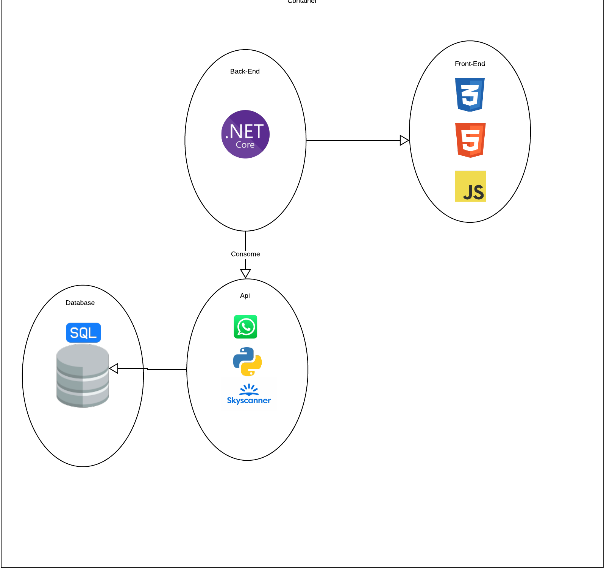
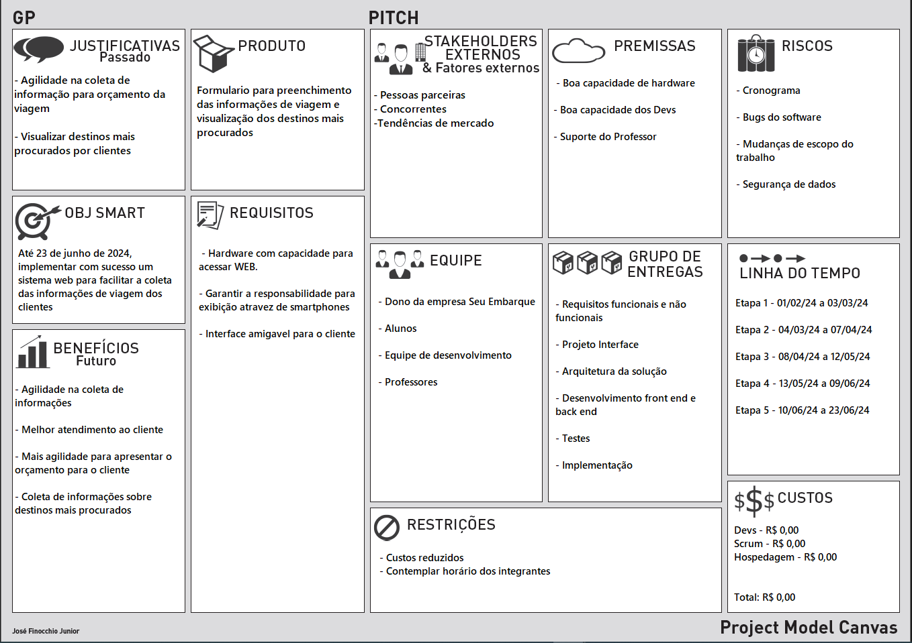
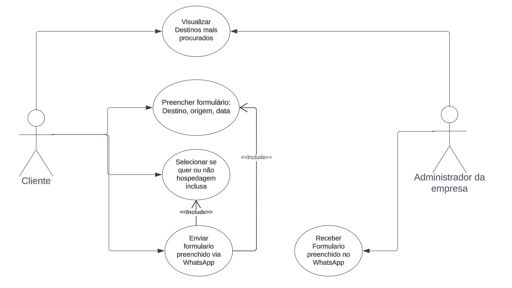
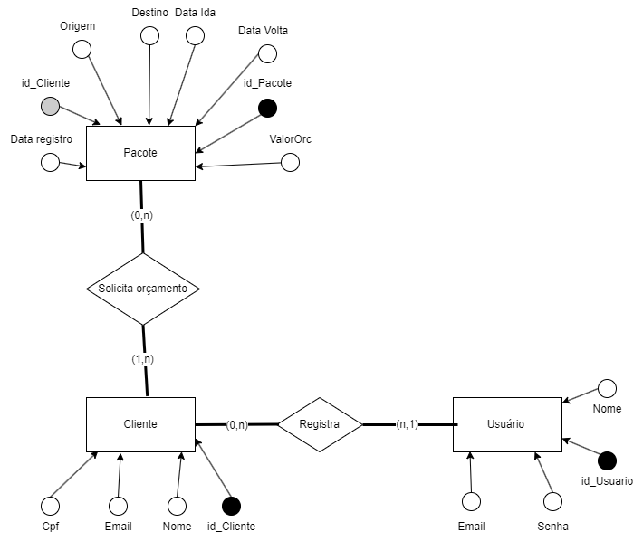
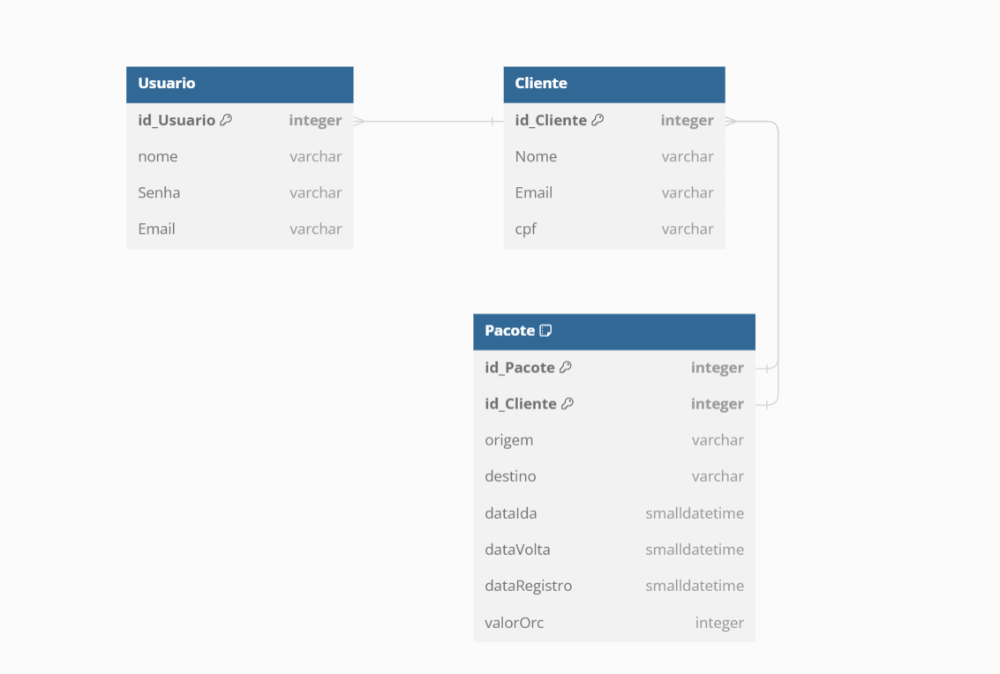

# Especificações do Projeto

Pré-requisitos: <a href="1-Documentação de Contexto.md"> Documentação de Contexto</a>

Definição do problema e ideia de solução a partir da perspectiva do usuário. É composta pela definição do  diagrama de personas, histórias de usuários, requisitos funcionais e não funcionais além das restrições do projeto.

Apresente uma visão geral do que será abordado nesta parte do documento, enumerando as técnicas e/ou ferramentas utilizadas para realizar a especificações do projeto

## Arquitetura e Tecnologias

O C# será utilizado no Back-End para consumir a API do WhatsApp e nossa API em Python, seguiremos o estilo arquitetural DDD.

Nosso Front-End será feito utilizando HTML,CSS,JavaScript e vamos contar com uma API em Python para armazenamento dados no Banco de dados.

## Project Model Canvas

## Requisitos

As tabelas que se seguem apresentam os requisitos funcionais e não funcionais que detalham o escopo do projeto. Para determinar a prioridade de requisitos, aplicar uma técnica de priorização de requisitos e detalhar como a técnica foi aplicada.

### Requisitos Funcionais

|ID    | Descrição do Requisito  | Prioridade |
|------|-----------------------------------------|----|
|RF-001| A aplicação deve conter o formulario para preenchimento das informações do cliente | ALTA |
|RF-002| No campo Destino e Origem o campo deverá retornar uma lista com os aeroportos para cidade desejada pelo cliente | MEDIA |
|RF-003| O sistema deverá conter uma checkbox para verificar se o cliente deseja uma viagem com hospedagem, ao selecionar sim ele deve permitir que o cliente selecione se quer algo incluso como café da manha e almoço| BAIXA |
|RF-004| A aplicação deve enviar via mensagem no Whatsapp ou Email as informações preenchidas pelo cliente| ALTA |
|RF-005| Ao enviar a Mensagem/Email das informações preenchidas o sistema deve armazenar no banco de dados o Destino, Origem e as datas do cliente| BAIXA |
|RF-006| A aplicação deverá ter uma tela para visualização dos destinos mais escolhidos pelos clientes| BAIXA |
|RF-007| Deverá ser desenvolvido uma api para mostrar os destinos mais procurados pelos clientes| BAIXA |
|RF-008| O sistema deve possuir uma tela para que o administrador possa registrar clientes e editar os mesmos| BAIXA |
|RF-009| O sistema devera ter uma tela para mostrar os pacotes pesquisados pelos clientes | BAIXA |
|RF-010| Na tela dos pacotes deverá ser possivel inserir o valor do orçamento feito para aquele pacote| BAIXA |

### Requisitos não Funcionais

|ID    | Descrição do Requisito  | Prioridade |
|------|-----------------------------------------|----|
|RNF-001| Garantir que a aplicação Web seja responsiva para visualização pelo smartphone   | MÉDIA |
|RNF-002| Os campos Origem e Destino deverá mostrar as opções de aeroportos na cidade em que o usuario digitar | MÉDIA |

## Restrições

O projeto está restrito pelos itens apresentados na tabela a seguir.

|ID| Restrição                                             |
|--|-------------------------------------------------------|
|01| O projeto deverá ser entregue até o final do semestre |

## Diagrama de Casos de Uso

## Modelo ER (Projeto Conceitual)

## Projeto da Base de Dados

