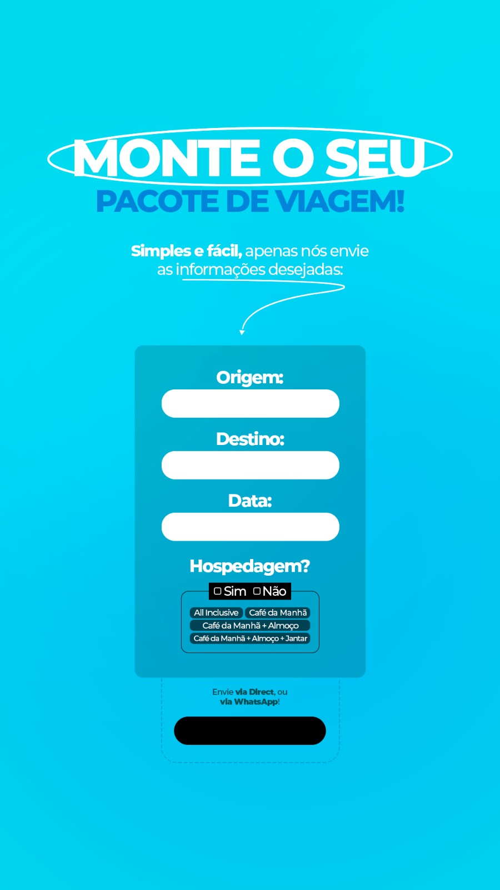
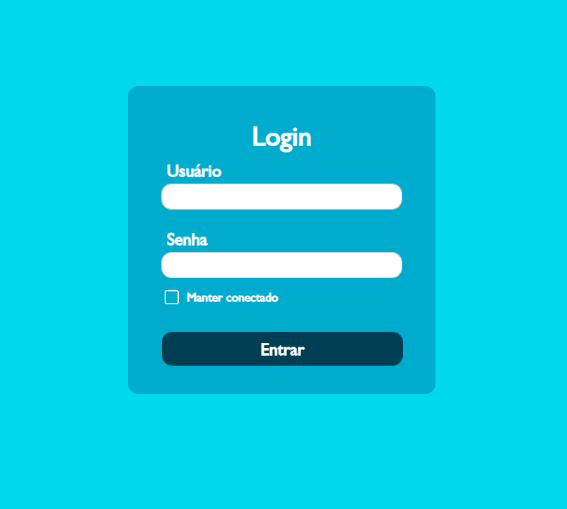
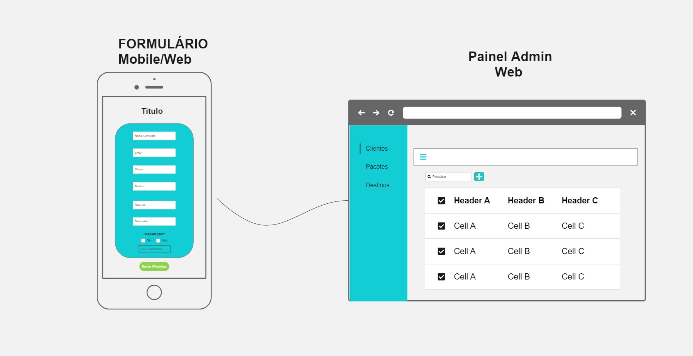

# Projeto de Interface

Pré-requisitos: <a href="2-Especificação do Projeto.md"> Documentação de Especificação</a>

## Projeto da interface formulário

## Tela de Login

## Wireframes da interface

